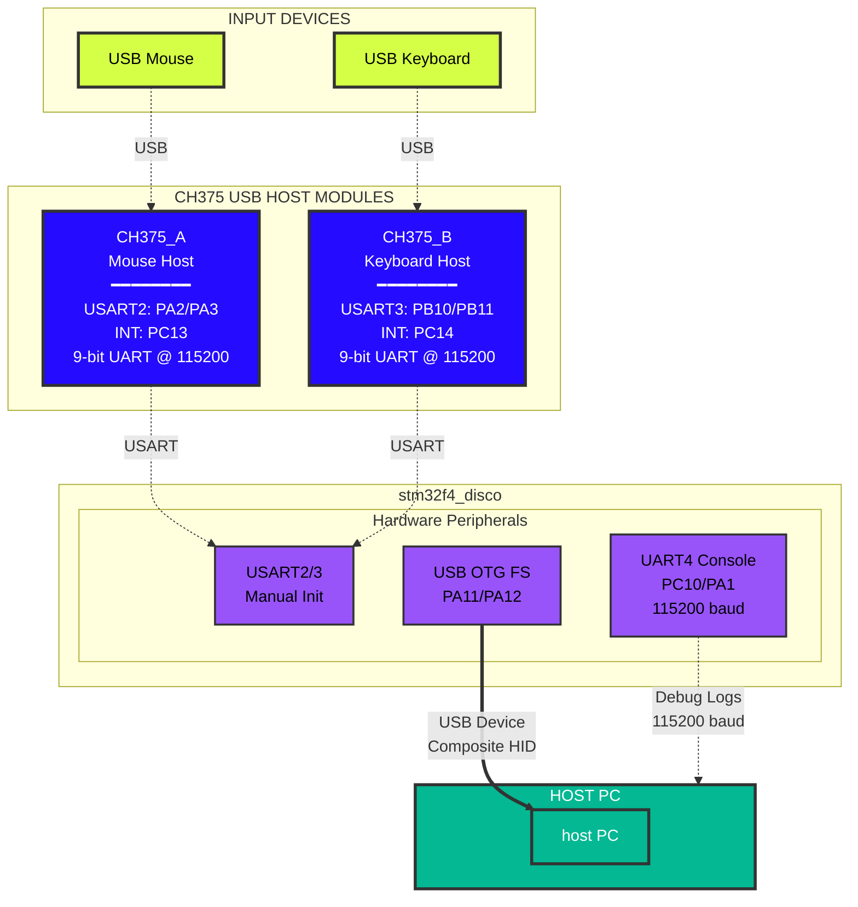

# GhostHIDe - USB HID Proxy

## Overview

GhostHIDe is a USB HID (Human Interface Device) proxy system built on Zephyr RTOS for STM32F4 Discovery board. It acts as a man-in-the-middle between USB input devices (mouse and keyboard) and a host PC, allowing for real-time input modification including automatic recoil compensation for gaming.

## Architecture



## Hardware Components

### Main Board
- **stm32f4_disco** (STM32F407VGT6)

### USB Host Interface
- **2x CH375 USB Host Controllers**
  - Connected via UART (9-bit mode for command/data differentiation)
  - One for mouse, one for keyboard
  - Communicates at 115200 baud after initialization

### Pin Configuration
```
CH375_A (Mouse):
  - USART2: PA2 (TX), PA3 (RX)
  - INT: PC13 (GPIO, active low)

CH375_B (Keyboard):
  - USART3: PB10 (TX), PB11 (RX)
  - INT: PC14 (GPIO, active low)

Console:
  - UART4: PC10 (TX), PA1 (RX) @ 115200 baud

USB Device:
  - USB OTG FS: PA11 (DM), PA12 (DP)
```

## Key Features

### 1. **Dual USB Host Support**
- Simultaneously connects to USB mouse and keyboard

### 2. **USB Device Emulation**
- Presents as composite HID device to PC
- Emulates both mouse and keyboard simultaneously
- Standard HID descriptors for maximum compatibility

## Critical Implementation Details

### CH375 9-bit UART Mode
The CH375 uses 9th bit to distinguish commands from data:
- **Command**: 9th bit = 1 (0x100 | cmd)
- **Data**: 9th bit = 0 (0x000 | data)

Implementation uses STM32 LL (Low-Level) drivers for direct register access since Zephyr's UART API **doesn't support** 9-bit mode.

### Manual UART Initialization
USART2/3 are disabled in Device Tree (`status = "disabled"`) and manually initialized to avoid conflicts with Zephyr's driver:

## Build Instructions

### Prerequisites
First, download Zephyr and install Zephyr SDK. Please, follow the official guide: https://docs.zephyrproject.org/latest/develop/getting_started/index.html

### Build
```bash
west build -p always -b stm32f4_disco /path/to/GhostHIDe
west flash
```

### Monitor
```bash
# Console output on UART4
screen /dev/ttyUSB0 115200
```

## Future Enhancements

- [ ] Adapt CH375 driver for Zephyr usage
- [ ] Implement HID layer
- [ ] Handle mouse
- [ ] Handle keyboard
- [ ] Dynamic modification of HID input