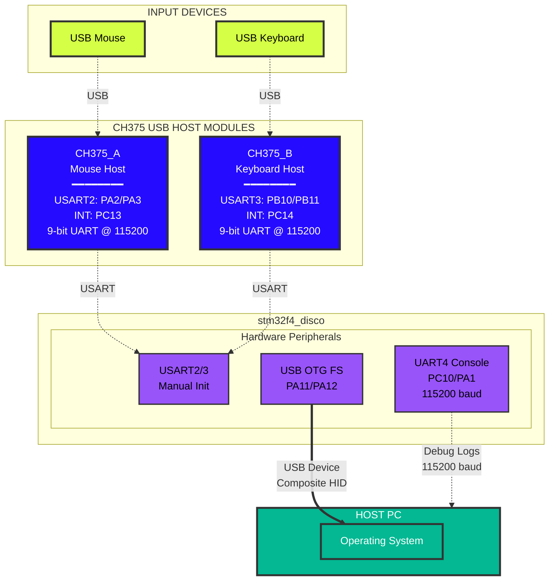

# GhostHIDe - USB HID Proxy

## Overview

GhostHIDe is a production-ready USB HID (Human Interface Device) proxy system built on Zephyr RTOS for STM32F4 Discovery board. It acts as a transparent man-in-the-middle between USB input devices (mouse and keyboard) and a host PC, enabling real-time input capture and modification.

The system features comprehensive HID report descriptor parsing, supporting a wide variety of mice with different report formats, button counts, and axis configurations. RGB lightning might not work on some mice and keyboards (if they have a specific endpoint for RGB control).

## Architecture


```mermaid
graph TB
    subgraph INPUT["INPUT DEVICES"]
        MOUSE["USB Mouse"]
        KEYBOARD["USB Keyboard"]
    end

    subgraph CH375_LAYER["CH375 USB HOST MODULES"]
        CH375A["CH375_A<br/>Mouse Host<br/>━━━━━━━━<br/>USART2: PA2/PA3<br/>INT: PC13<br/>9-bit UART @ 115200"]
        CH375B["CH375_B<br/>Keyboard Host<br/>━━━━━━━━<br/>USART3: PB10/PB11<br/>INT: PC14<br/>9-bit UART @ 115200"]
    end

    subgraph STM32["stm32f4_disco"]
        subgraph HW["Hardware Peripherals"]
            USART["USART2/3<br/>Manual Init"]
            USBOTG["USB OTG FS<br/>PA11/PA12"]
            CONSOLE["UART4 Console<br/>PC10/PA1<br/>115200 baud"]
        end
    end

    subgraph PC["HOST PC"]
        OS["Operating System"]
    end

    MOUSE -.->|USB| CH375A
    KEYBOARD -.->|USB| CH375B

    CH375A -.->|USART| USART
    CH375B -.->|USART| USART
    
    USBOTG ==>|"USB Device<br/>Composite HID"| OS

    CONSOLE -.->|"Debug Logs<br/>115200 baud"| PC

    classDef inputDevice fill:#D5FF46,stroke:#333,stroke-width:3px,color:#000
    classDef usbChip fill:#250BFF,stroke:#333,stroke-width:3px,color:#fff
    classDef hardware fill:#9854F9,stroke:#333,stroke-width:2px,color:#000
    classDef pc fill:#03B893,stroke:#333,stroke-width:3px,color:#fff

    class MOUSE,KEYBOARD inputDevice
    class CH375A,CH375B usbChip
    class USART,USBOTG,CONSOLE hardware
    class OS,PC pc
```

## Hardware Components

### Main Board
- **stm32f4_disco** (STM32F407VGT6)

### USB Host Interface
- **2x CH375 USB Host Controllers**
  - Connected via UART (9-bit mode for command/data differentiation)
  - One dedicated for mouse, one for keyboard
  - Operates at 115200 baud after initialization
  - Hardware interrupt pins for event notification

### Pin Configuration
```
Mouse:
  - USART2: PA2 (TX), PA3 (RX)
  - INT: PC13 (GPIO, active low)

Keyboard:
  - USART3: PB10 (TX), PB11 (RX)
  - INT: PC14 (GPIO, active low)

Console:
  - UART4: PC10 (TX), PA1 (RX) @ 115200 baud

USB Device:
  - USB OTG FS: PA11 (DM), PA12 (DP)
```

## Key Features

### 1. **Dual USB Host Support**
- Simultaneously connects to USB mouse and keyboard
- Independent enumeration and communication
- Per-device interrupt handling

### 2. **USB Device Emulation**
- Presents as composite HID device to PC
- Emulates both mouse and keyboard simultaneously
- Standard HID descriptors for maximum compatibility

### 3. **Dynamic HID Parser**
- Parses arbitrary HID report descriptors at runtime
- Supports wide variety of device formats:
  - **Mice**: 3-16 buttons, 8/16-bit axes, optional wheel
  - **Keyboards**: Standard 6-key rollover, modifier keys
- Automatically detects report structure and field offsets
- Handles Report ID presence/absence

### 4. **Input Translation Layer**
- Normalizes variable input formats to standardized output
- Preserves all button states and axis values
- Efficient report filtering and forwarding
- Minimal latency overhead

### 5. **Comprehensive Testing**
- Unit tests covering all major components
- Mock hardware layer for isolated testing
- Real-world device descriptor validation
- Zephyr ztest framework integration

## Software Architecture

### Driver Stack

#### CH375 Driver (`drivers/ch375/`)
Low-level USB host controller driver implementing the CH375 protocol:

**Core Protocol** (`ch375.c/h`):
- Device existence check and version query
- USB mode configuration (host with SOF)
- Status monitoring and interrupt handling
- Block data transfer primitives

**UART Hardware Layer** (`ch375_uart.c/h`):
- Manual UART initialization bypassing Zephyr API
- 9-bit mode configuration using STM32 LL drivers
- Command/data differentiation via 9th bit
- Dynamic baudrate switching (9600 → 115200)

**USB Host Layer** (`ch375_host.c/h`):
- Device enumeration and address assignment
- Descriptor retrieval (device, configuration, interface, endpoint)
- Control transfers with SETUP/DATA/STATUS stages
- Bulk transfers with NAK handling and retry logic
- Endpoint management and toggle tracking

#### HID Parser (`drivers/hid/`)
High-level HID device abstraction with dynamic parsing - uses deprecated APIs :

**Generic Parser** (`hid_parser.c/h`):
- HID report descriptor item fetching
- Device type detection (mouse/keyboard/other)
- Report buffer allocation and management
- Bulk transfer wrapper for HID GET_REPORT

**Mouse Handler** (`hid_mouse.c/h`):
- Dynamic button field extraction (variable bit positions)
- Orientation axis parsing (8/16/32-bit, signed/unsigned)
- Wheel support detection and handling

**Keyboard Handler** (`hid_keyboard.c/h`):
- Modifier key bitmap (8 bits for Ctrl/Shift/Alt/GUI)
- Key code array management (6-key rollover)
- Duplicate key prevention

**Output Translator** (`hid_output.c/h`):
- Input format normalization
- Report ID filtering for multi-report devices
- Standardized output report generation

### Application Layer

#### USB Device Proxy (`src/usb_hid_proxy.c`)
Composite USB HID device implementation:
- Registers separate mouse and keyboard interfaces
- Uses legacy Zephyr USB stack for dynamic data modification
- Semaphore-based endpoint synchronization
- Comprehensive USB state tracking

## Critical Implementation Details

### CH375 9-bit UART Mode
The CH375 uses the 9th bit to distinguish commands from data:
- **Command**: 9th bit = 1 (0x100 | cmd)
- **Data**: 9th bit = 0 (0x000 | data)

Implementation uses STM32 LL (Low-Level) drivers for direct register access since Zephyr's UART API doesn't support 9-bit mode. USART2/3 are disabled in Device Tree and manually initialized to avoid conflicts.

### HID Report Descriptor Parsing
The parser implements a state machine that walks through HID items:
1. Tracks global state (usage page, logical min/max, report size/count)
2. Accumulates local state (individual usages)
3. Processes main items (Input/Output/Feature) to identify fields
4. Calculates byte offsets and bit positions for each field
5. Handles both absolute and relative values
6. Detects report ID presence for proper offset adjustment

## Build Instructions

### Prerequisites
First, download Zephyr and install Zephyr SDK. Follow the official guide:
https://docs.zephyrproject.org/latest/develop/getting_started/index.html

### Build
```bash
west build -p always -b stm32f4_disco /path/to/GhostHIDe
west flash
```

## Testing

### Quick Start - Run All Tests

```bash
# From Zephyr workspace root
west twister -T /path/to/GhostHIDe/tests/unit/ch375 -p native_sim
```

### Run with Verbose Output

```bash
west twister -T /path/to/GhostHIDe/tests/unit/ch375 -p native_sim -v
```

## Project Status

### Completed Features
- [x] CH375 driver adapted for Zephyr
- [x] Mouse input handling
- [x] Keyboard input handling
- [x] USB device composite output
- [ ] Input modification
- [ ] Extended keyboard support (N-key rollover, vendor-specific features)

## Troubleshooting

## License

This project is licensed under the GNU General Public License v3.0 or later.

Copyright (c) 2025 akaDestrocore

This program is free software: you can redistribute it and/or modify
it under the terms of the GNU General Public License as published by
the Free Software Foundation, either version 3 of the License, or
(at your option) any later version.

See [LICENSE](LICENSE) for full details.